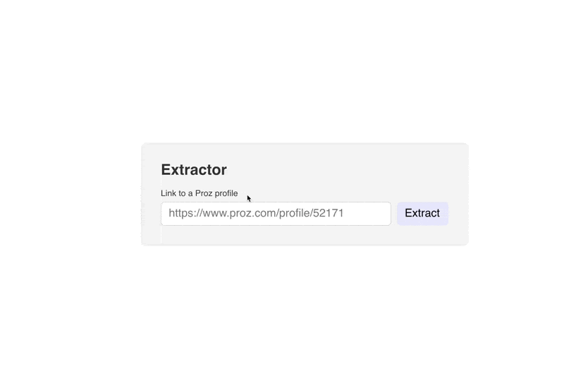

# Travod test case - Proz parser
This parser is a demo project that will help people to automate data extraction from Proz (a Freelancer-like platform for linguists).

## Todos
- [x] To parse data from both profile and translator pages
- [x] To save extracted data after manual review
- [ ] To figure out how to deal with unavailable or unreachable Proz website
- [ ] To think about a queue for parsing requests
- [ ] To dive deeper into the process to understand the best code architecture
- [ ] To not parse too often the links we already parsed
